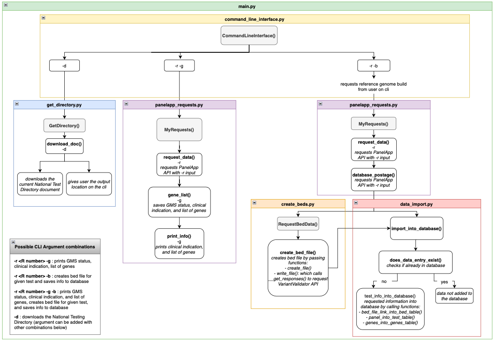
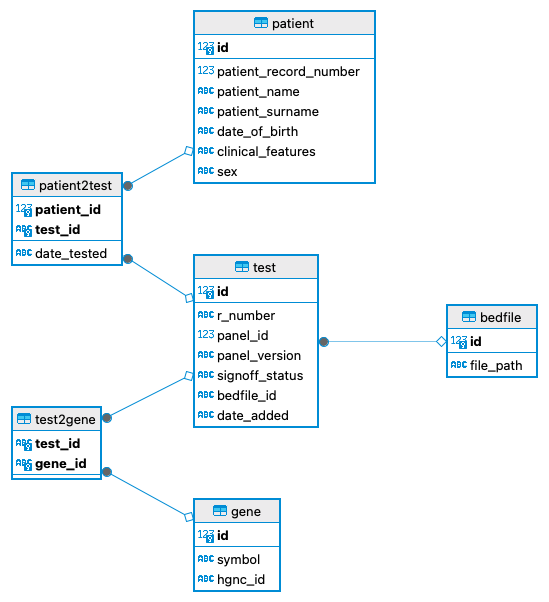
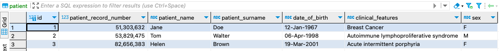
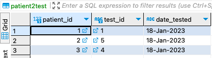
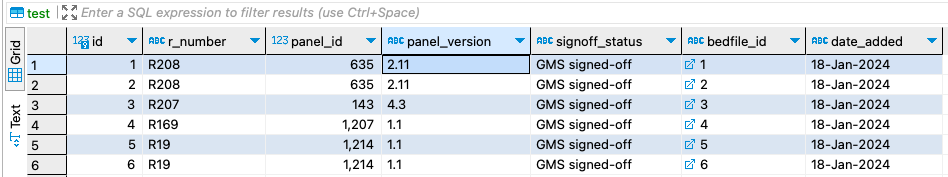
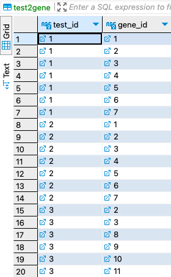
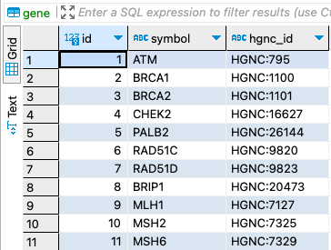

# USER MANUAL
Date created: 23-Jan-2024  
Date modified: 24-Jan-2024  
Authors: Caroline Riehl  

## Installation 
See the [INSTALL.md](INSTALL.md) document for full instructions.

## Operation
NGTD_App is operated by running the python `main.py` script. Running the script with the `-h` flag shows the different options of how to run the tool.

```
usage: main.py [-h] [-g] [-b] [-r R_NUMBER] [-d [DOWNLOAD_DIRECTORY]]

options:
  -h, --help            show this help message and exit
  -g, --gene_list       Return a list of genes from a gene panel (provide the R number via the -r flag)
  -b, --create_bed      Generate a bed file for a gene panel (provide the R number via the -r flag). Outputs to
                        bed_repository/
  -r R_NUMBER, --r_number R_NUMBER
                        Provide the R number from the National Genomic Test Directory that you wish to enquire about
  -d [DOWNLOAD_DIRECTORY], --download_directory [DOWNLOAD_DIRECTORY]
                        Download the latest national test directory. Please provide an output location. Outputs by
                        default to the docs/ directory

```

## Examples
*[arg] is a valid R number from National Genomic Test Directory.*

**To obtain a list of genes relating to a panel and its clinical indication:**
```
python3 main.py -r [arg] -g
```
Command Line Interface Output:
```
This panel is GMS signed-off

Clinical Indication: Inherited ovarian cancer (without breast cancer)
Genes included in the R207 panel: BRCA1 BRCA2 BRIP1 MLH1 MSH2 MSH6 PALB2 RAD51C RAD51D PMS2 AR ATM BARD1 CDH1 CHEK2 EPCAM ESR1 MUTYH NBN PPM1D PTEN RAD54L RRAS2 STK11 TP53 XRCC2
No panel information added to the database. Run with -b to add the data.

Logging: main.py ran successfully
```

**To create a bed file for a panel and to add the corresponding information (panel, genes list, bed file path) to the database:**
```
python3 main.py -r [arg] -b 
# Input when prompted the version of the reference genome for which to create the bed file, 37 or 38.
```
Command Line Interface Output:
```
# If the panel does not yet exist in the database:
This panel has not been saved in the database yet. Panel information import to the database to proceed.
Panel information and associated bed file path (<path/to/bedfile>) added to the database successfully!

# If the panel already exists in the database under the same version, but the bed file was created for a different genome build:
This panel is already saved in the database but under a different reference genome build. This panel with the new reference build will therefore be added to the database.
Panel information and associated bed file path (<path/to/bedfile>) added to the database successfully!

# If the panel already exists in the database but under a different version:
This panel is already saved in the database but under a different version. The information of this newer version will therefore be added to the database.
Panel information and associated bed file path (<path/to/bedfile>) added to the database successfully!

# If the panel exists in the database under the same version and the existing bed file was created with the requested genome build:
This panel is already saved in the database under the same version and the same reference genome build. This data entry will therefore not be added again to prevent duplications.
```

**To help find a valid panel R number with the corresponding clinical indication, the current National Test Directory document can be downloaded using the `-d` flag:**
```
python3 main.py -d
```
Command Line Interface output:
```
Downloaded Test Directory Version 6
It can be found in: ~/NGTD_App/docs/Rare-and-inherited-disease-national-genomic-test-directory-version-6.xlsx
```  

### Please Note
The `-r` flag to provide a valid panel R number is always required when using flags `-b` and `-g`.  
Flags `-b`, `-g`, `-d` may all be used at the same time.

The following flag combinations are also valid:
- `-r [arg] -g -b`  
- `-d -r`  
- `-d -r [arg] -g`  
- `-d -r [arg] -b`  
- `-d -r [arg] -g -b`    

## Scripts
The programme uses the following scripts:
1. **`main.py`**: the main script that is used to run all other scripts  
2. **`command_line_interface.py`**: script to capture all user arguments provided by the user  
3. **`panelapp_request.py`**: script to query the [PanelApp API](https://panelapp.genomicsengland.co.uk/api/docs/) using the panel R number provided by the user  
4. **`create_beds.py`**: script to create the bed file using [VariantValidator rest API](https://rest.variantvalidator.org) depending on the R number and the reference genome build provided by the user  
5. **`data_import.py`**: script to upload panel information and bed file location to the database  
6. **`get_directory.py`**: script to download the current [National Genomic Test Directory](https://www.england.nhs.uk/publication/national-genomic-test-directories/) document into the `NGTD_App/docs/` directory  

### Script Flow UML
Below is a UML of the flow of the different scripts showcasing their key classes and the functions that are called.


## Database
The database, `ngtd.db`, was created using the script `database.py`.  

It holds 6 tables:
- *patient*: contains patient data, including a record number, first name, surname, date of birth, clinical features, sex  
- *test*: contains test information, including a panel's R number, id, version, signoff status, bedfile id (foreign key of *bedfile* table), and the date it was added to the database  
- *gene*: contains gene information, including its symbol and HGNC ID (which remains the same when the symbol changes)  
- *bedfile*: contains the file path of the bed file's location  
- *patient2test*: a join table that links patient records to tests using these tables' primary keys  
- *test2gene*: a join table that links tests to genes using these tables' primary keys  

### Database UML 
  

### Database content
`ngtd.db` already holds some data which may be viewed using a database tool such as [DBeaver](https://dbeaver.io). The tables *test*, *gene*, *test2gene*, and *bedfile* were populated by running the `main.py` script. Dummy patient data was added to the database and linked to tests via *patient2test* manually.  

**Table *patient***  
  

**Table *patient2test***  
  

**Table *test***  
   

When running the `main.py` script with `-r [arg] -b`, `data_import.py` first checks whether the panel, its most up-to-date version, and the bed file for the requested genome build already exist in the database. If any of those 3 options differ, the panel information is added to the database along with the path of the location of the new bed file.  

As multiple panels may contain the same genes, the script ensures that no duplicates of genes are created by checking for the presence of the gene's HGNC ID in the gene table. If the ID already exists, its primary key is used to link it to the new test in the *test2gene* table. If the HGNC ID does not yet exist, a new entry and new primary key are created in the *gene* table and used instead. 

**Table *test2gene***  


**Table *gene***  
  

## Logging
Logging is carried out using the `logger.py` script, configured under `config.py`, which tracks the running of all scripts.   
To minimise storage issues, `logger.py` creates a rotating log file that resets at midnight.

All logs are stored in NGTD_App/logs.

## Basic Debugging 
### Error handling
The NGTD_App was designed to check for common mistakes and provide helpful error messages when needed. These will be recorded in the `logs/` directory and will also be printed on the command line interface.

**Example**
```
> python3 main.py       
Error: Must select at least one of the following options: "--gene_list", "--create_bed", "--download_directory"
```

```
> python3 main.py -g
If gene_list is selected, an R number must be given with flag -r
```

```
> python3 main.py -b
If bed file creation selected, an R number must be  passed with flag -r
```

### Understanding `main.py` flags 
The correct handling of flags can be investigated by reading the operation section within this document or running `main.py` with the `--help (-h)` flag directly. This will output a summary of all flags and how to use them. 

### Invalid R number
If an invalid R number is provided, the following error message will be received.
```
HTTP Error: R number is not associated with a gene panel or does not exist.
Please refer to Genomic Test Directory for guidance.
```

The current NHS Genome Testing Directory document can be downloaded using the following command:
```
python3 main.py -d
```
This document will by default be saved within the `docs/` directory and can then be used to identify the valid R number associated with a clinical indication. 

### Investigate database
To perform checks on the database and verify that data has been added as expected, `ngtd.db` may be opened using a database administration tool such as [DBeaver](https://dbeaver.io).  

DBeaver can be downloaded using the following [link](https://dbeaver.io/download/). DBeaver Community is a free and open source tool. Select the application corresponding to your local operating system. Further guidance may be found under this [link](https://dbeaver.com/docs/dbeaver/).  

The contents of the database can then be viewed.  