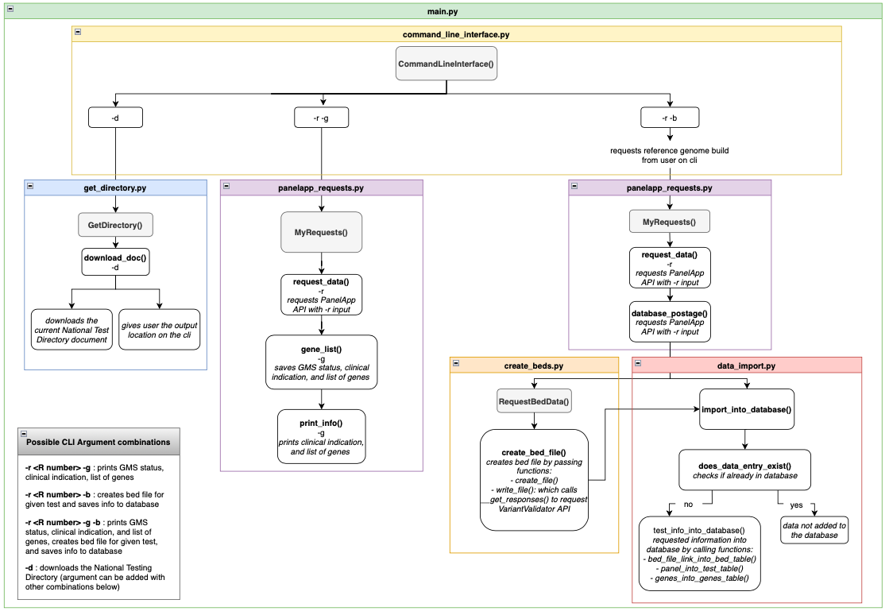
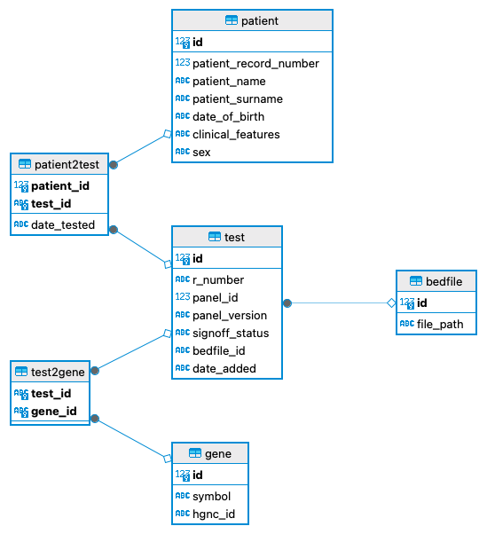

# README.md
Date created: 07-Nov-2023  
Date modified: 26-Jan-2024  
Authors: Dolapo Ajayi, Niall Gallop, Caroline Riehl, Danni Scales  

## About
The NGTD app is a tool to manage gene panels for [NHS National Genomic Test Directory](https://www.england.nhs.uk/publication/national-genomic-test-directories/) tests in the laboratory

### Project Aims:
1. Find a relevant gene panel for a genomic test to assist analysis of sequence data
    - Use [PanelApp API](https://panelapp.genomicsengland.co.uk/api/docs/) to retrieve a list of genes in a given gene panel, based on a given R number
    - Expand this functionality to accept a list of R numbers
    - Investigate expanding functionality to accept more than just R numbers
2. Generate a BED file from a gene panel that can be used as an input for an NGS pipeline
3. Build a safe and efficient repository of genetic tests and panel information
    - For use in the laboratory 
    - Emphasis on reliability and speed
4. Build a repository of which tests, gene panels, BED files, reference sequences and version which have been applied to each patient case so that the laboratory has an accurate record of how analyses were performed.  

## Pre-requisites for Local Installation
NGTD_App will work locally on Mac OS X or Linux-compatible computers.  

### Required Software:
- Python 3
- Pytest v7.4.2
- Pytest-cov v4.1.0
- Coverage v7.4.0
- Argparse v1.4.0
- Config v0.5.1
- Certifi v2023.7.22
- Charsey-normalizer v3.3.2
- Idna v3.4
- Iniconfig v2.0.0
- Packaging v23.2
- Pluggy v1.3.0
- Requests v2.31.0
- Setuptools v68.0.0
- Urllib3 v2.0.7
- Wheel v0.37.1

## Installation Manual
See the [INSTALL.md](INSTALL.md) document for full instructions.  

## Operation
See the [MANUAL.md](MANUAL.md) document for full instructions on how to run the NGTD_App tool.  

## Scripts
The programme uses the following scripts:  
1. `main.py`: the main script that is used to run all other scripts  
2. `command_line_interface.py`: script to capture all arguments provided by the user  
3. `get_directory.py`: script to download the current [NHS National Genomic Test Directory](https://www.england.nhs.uk/publication/national-genomic-test-directories/) document into the docs/ directory  
4. `panelapp_request.py`: script to query the [PanelApp API](https://panelapp.genomicsengland.co.uk/api/docs/) using the panel R number provided by the user  
5. `create_beds.py`: script to create the bed file using [VariantValidator rest API](https://rest.variantvalidator.org) depending on the R number and the reference genome build provided by the user  
6. `data_import.py`: script to upload panel information and bed file location to the database  

### Script Flow UML
Below is a UML of the flow of the different scripts showcasing their key classes and the functions that are called.
  

## Database
The database, `ngtd.db`, was created using the script `database.py`.  
It holds 4 tables (*patient*, *test*, *gene*, *bedfile*) and 2 join tables (*patient2test*, *test2gene*).

The *patient2test* table links patients to tests using the corresponding tables' primary keys. Tests are linked to genes in a similar manner with *test2gene*.  

Please find the UML of the database below:  
  

`ngtd.db` already holds some data which may be viewed using a database tool such as DBeaver. The tables *test*, *gene*, *test2gene*, and *bedfile* were populated by running the `main.py` script. Dummy patient data was added to the database and linked to tests via *patient2test* manually.  

**Please see the [MANUAL.md](MANUAL.md) document for further details on the database structure and content.** 

## Unit & Functional Testing
Unit and functional tests have been developed for the following scripts:

| Script | Test file |
|--------|-----------|
| main.py | main_test.py|
| command_line_interface.py | cli_test.py |
| create_beds.py | create_beds_test.py |
| data_import.py | data_import_test.py |
| panelapp_requests.py | panelapp_requests_test.py |
| get_directory.py | get_directory_test.py |

Additionally, a `conftest.py` file was created to hold the fixture for `data_import_test.py`. 

Tests can be run automatically when running the `pytest` command from the NGTD_App directory  
```
cd NGTD_App
```
Run Pytest
```
pytest test/
```

## License
[](https://opensource.org/licenses/MIT)  
This project is licensed under the [MIT License](https://opensource.org/licenses/MIT) - see the [LICENSE.md](LICENSE.md) file for details.
